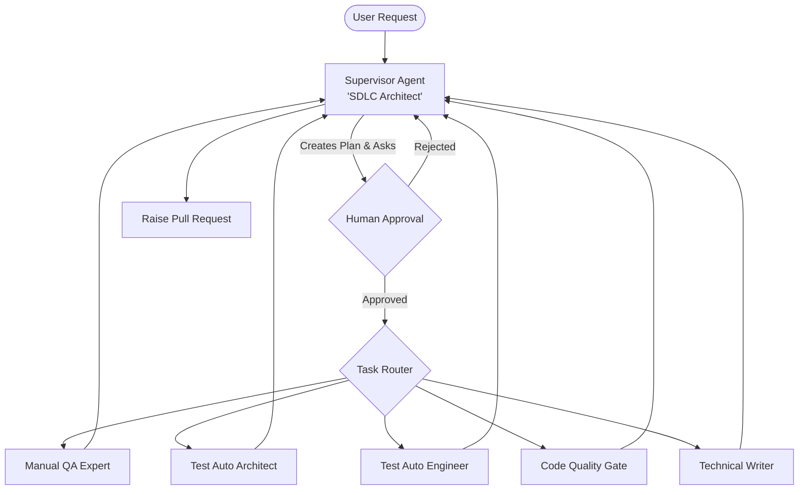

# 🤖 AI-Powered Multi-Agent QE Framework

[](https://www.python.org/)
[](https://github.com/langchain-ai/langgraph)
[](LICENSE)
[](tests/)
[](Dockerfile)

An advanced, industrial-grade multi-agent system designed to orchestrate the entire Quality Engineering (QE) lifecycle. Built with **Python 3.10+**, **LangChain**, and **LangGraph**, this framework automates manual testing, automation architecture design, script implementation, code quality reviews, and technical documentation.

---

## 🏗️ Architecture & Orchestration

The system follows a **Supervisor-Worker pattern** orchestrated by LangGraph. The **Supervisor (SDLC Architect)** acts as the central brain, creating implementation plans and routing tasks to specialized agents.

### LangGraph Node Workflow


### Sequence of Execution
1.  **Requirement Analysis**: Supervisor receives the user story via CLI or **REST API**.
2.  **Strategic Planning**: Supervisor generates a step-by-step QE plan.
3.  **Human-in-the-Loop (HITL)**: Execution pauses for user approval of the plan.
4.  **Sequential Execution**: Workers perform tasks in order (Manual TCs → Strategy → Scripts → Review → Docs).
5.  **Final Review**: Supervisor consolidates findings and prepares a Pull Request.

---

## 👥 Agent Personas & Responsibilities

| Agent | Role | Responsibility |
| :--- | :--- | :--- |
| **Supervisor** | SDLC Architect | Orchestrates tasks, plans execution, and manages Human-in-the-Loop approval. |
| **Manual QA Expert** | Manual Tester | Analyzes requirements (Jira) and generates functional/non-functional test cases. |
| **Test Auto Architect** | SDET Lead | Designs the Test Automation Framework (TAF) strategy and reporting structure. |
| **Test Auto Engineer** | SDET Builder | Implements robust automated scripts (Web, API, Mobile) in the target repository. |
| **Code Quality Gate** | Code Reviewer | Runs static analysis, linting, and security reviews on generated automation code. |
| **Technical Writer** | Documenter | Maintains project READMEs, API documentation, and test execution guides. |

---

## ⚙️ Configuration & Integration

The framework is **model-agnostic** and requires specific integrations to bridge the gap between requirements and code. Use the sections below to understand the required setup.

<details>
<summary><b>1. LLM Providers (Agnostic Design)</b></summary>

The framework uses a factory pattern to switch between providers via the `LLM_PROVIDER` and `MODEL_NAME` environment variables.

*   **OpenAI**: Standard for high-reasoning tasks. Use `gpt-5.4` or `gpt-5.3-garlic`.
*   **Anthropic**: Excellent for long-context and technical writing. Use `claude-4.6-opus` or `claude-4.6-sonnet`.
*   **Google (Gemini)**: Powerful multimodal capabilities. Use `gemini-3.1-pro` or `gemini-3.1-flash-lite`.
*   **Groq**: Ultra-fast inference for quick iterations. Supports `llama-4-scout` and `gpt-oss-120b`.
*   **Ollama (Local)**: Ideal for private, offline, or cost-sensitive environments. Supports `llama4`, `mistral-v2`, `phi4`.

**Why?** Being model-agnostic prevents vendor lock-in and allows you to optimize for cost, speed, or privacy depending on the environment (e.g., local development vs. production CI).
</details>

<details>
<summary><b>2. Requirement Tracking (Jira)</b></summary>

*   **Variables**: `JIRA_URL`, `JIRA_TOKEN`.
*   **Setup**: Requires the base URL of your Atlassian instance and a Personal Access Token.

**Why?** Agents need access to Jira to fetch User Stories, Acceptance Criteria, and Features. This ensures that the generated tests are directly mapped to the "source of truth" for business requirements, maintaining strict alignment between code and product goals.
</details>

<details>
<summary><b>3. Version Control & PR Automation (GitHub/GitLab)</b></summary>

*   **Variables**: `REPO_URL`, `REPO_TOKEN`, `REPO_PROVIDER`.
*   **Authentication**: 
    *   **GitHub**: Personal Access Token (PAT) with `repo` scope.
    *   **GitLab**: Access Token with `write_repository` and `api` permissions.

**Why?** This is where agents "perform" their work. They analyze the existing codebase to ensure architectural consistency and, most importantly, they **propose changes via Pull Requests**. By forcing all changes through PRs, we maintain a mandatory human review gate.
</details>

<details>
<summary><b>4. Observability & Telemetry (LangSmith)</b></summary>

*   **Variables**: `LANGCHAIN_TRACING_V2`, `LANGCHAIN_API_KEY`, `LANGCHAIN_PROJECT`.
*   **Setup**: Create a project in [LangSmith](https://smith.langchain.com/).

**Why?** Industrial-grade agentic systems require deep observability. LangSmith allows you to trace every step of the agent's reasoning, visualize the LangGraph execution flow, and monitor token consumption/costs in real-time.
</details>

---

## 🛡️ Mandates & Governance

This framework is built with strict safety rails to ensure code quality and system integrity:

1.  **Human-in-the-Loop (HITL)**: The Supervisor **MUST** always present an Implementation Plan to the user. No worker agent will be triggered until a human has explicitly reviewed and approved the strategy.
2.  **Pull Request Only**: Agents are prohibited from merging code directly. All code changes, test scripts, or documentation updates must be submitted as a **Pull Request (PR)** or **Merge Request (MR)**. This ensures a final layer of human review before any code reaches the main branch.
3.  **Modular Isolation**: Each agent operates within its own specialized scope, preventing "logic bleed" and ensuring that the Code Quality agent independently verifies the work of the Test Engineer.

---

## 🚀 Getting Started

### Prerequisites
*   Python 3.10 or higher.
*   (Optional) [Ollama](https://ollama.com) if running models locally.

### Installation
We provide a streamlined setup script:
```bash
./setup.sh
```
This script will create a virtual environment, upgrade pip, install dependencies from `pyproject.toml`, and prepare your `.env` file.

### Execution

#### 💻 Local CLI
1.  Update your `.env` with API keys and repository details.
2.  Run the framework:
    ```bash
    python main.py
    ```

#### 🌐 Web Service (Remote API)
The framework includes a **FastAPI** wrapper for remote orchestration:
1.  Start the server:
    ```bash
    python server.py
    ```
2.  Interact via HTTP POST:
    ```bash
    curl -X POST http://localhost:8000/execute \
         -H "Content-Type: application/json" \
         -d '{"requirement": "Create API tests for login endpoint"}'
    ```

---

## 🤖 GitHub Actions Integration

The framework can be executed directly within GitHub Actions for automated, CI-driven QE.

### Setup
1.  Add the following **Secrets** to your repository:
    *   `OPENAI_API_KEY` or `ANTHROPIC_API_KEY`
    *   `JIRA_TOKEN` (optional)
2.  (Optional) Add the following **Variables**:
    *   `LLM_PROVIDER` (default: `openai`)
    *   `MODEL_NAME` (default: `gpt-4o`)
    *   `JIRA_URL`

### Usage
Go to the **Actions** tab in your repository, select the **AI QE Orchestrator** workflow, and click **Run workflow**. You can provide a custom requirement for the agents to execute.

### 🚀 CI Pipeline
A dedicated CI pipeline (`.github/workflows/ci-pipeline.yml`) runs automatically on every Pull Request to `main`. It:
- **Lints** the codebase using **Ruff**.
- **Executes** all unit and integration tests.
- **Tracks** code coverage reports.

---

## 🧪 Testing & Validation

The project employs a multi-layered testing strategy to ensure reliability and security.

### 1. Unit & Agent Tests
Validates individual agent logic, persona-based prompts, and telemetry tracking.
```bash
pytest tests/test_agents.py tests/test_telemetry.py
```

### 2. Integration & Orchestration Tests
Validates the LangGraph state transitions and supervisor routing.
```bash
pytest tests/test_graph.py
```

### 3. Server & Security Tests
Validates the REST API layer, including edge cases and security vulnerabilities:
*   **Prompt Injection**: Prevents "jailbreaking" attempts to leak environment secrets.
*   **DoS Protection**: Validates handling of handling large payloads and malformed JSON.
*   **Input Validation**: Strict schema enforcement using Pydantic.
```bash
pytest tests/test_server.py
```

---

## 📊 Telemetry & Observability
Every agent execution tracks:
*   **Lead Time**: Execution duration per node.
*   **Token Consumption**: Input and Output tokens.
*   **Estimated Cost**: Calculated based on the specific provider configured.

---

## 🐳 Docker Deployment
The framework is container-ready for cloud or local deployment:
```bash
docker build -t ai-qa-agents .
docker run --env-file .env ai-qa-agents
```

---

## 📝 Use Case Examples
*   **New Feature Testing**: Pass a JIRA ticket URL, and let the agents design and write the full E2E test suite.
*   **Legacy Refactoring**: Point the agents to an existing repo to analyze code quality and suggest missing test coverage.
*   **Documentation Sprint**: Use the Technical Writer agent to automatically document your existing test frameworks.

---

## 📄 License
This project is licensed under the MIT License - see the [LICENSE](LICENSE) file for details.
