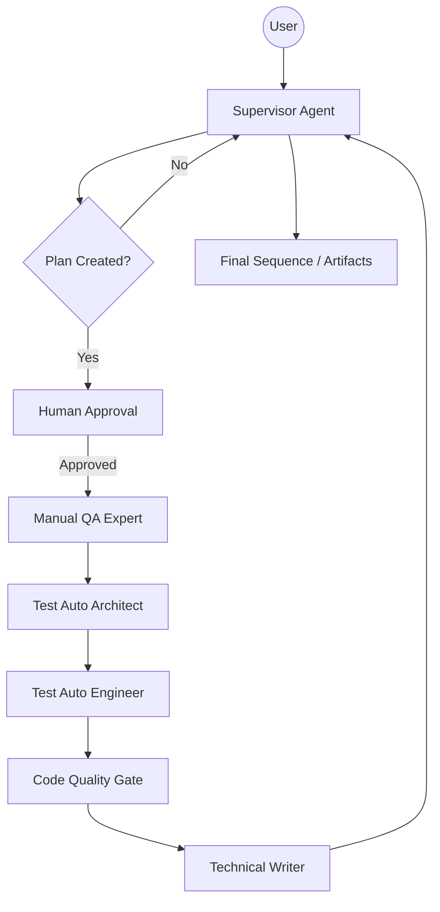

# Architecture

QORE is built on a modular, multi-agent architecture using **LangGraph** for orchestration, **FastAPI** for the backend, and **Next.js** for the Command Center UI.

## System Overview

The system follows a "Supervisor-Worker" pattern. The Supervisor agent receives user requirements, creates an execution plan, and then orchestrates the sequence of specialized worker agents.

### High-Level Components

- **QORE API (Python/FastAPI):** Manages the LangGraph state machine, persistence via SQLite, and real-time WebSocket communication.
- **QORE UI (Next.js/React):** An enterprise-grade interface for interacting with agents, visualizing the orchestration graph, and viewing generated artifacts.
- **Agentic Engine:** A collection of specialized LLM-powered nodes that execute QE tasks.

## Orchestration Flow

The following diagram illustrates the lifecycle of a QORE orchestration:

## Data Persistence

QORE uses an asynchronous SQLite checkpointer (`AsyncSqliteSaver`) to ensure that every agent transition and state update is persisted. This allows for:
- **Resuming Workflows:** Continue an orchestration after a server restart or long HITL pause.
- **Traceability:** Full history of messages and metrics for every `thread_id`.
- **Fault Tolerance:** Recover from failures without losing progress.

## Real-Time Observability

The API streams granular events via WebSockets using `astream_events`. This enables the UI to:
1.  **Pulse Active Nodes:** Visualize which agent is currently thinking.
2.  **Stream Tokens:** Show agent "thoughts" in real-time.
3.  **Update Metrics:** Track compute cost and lead time dynamically.
